# Knitting app: AI assistant and AI swatch preview (POCs)

Two proofs of concept for a mobile-first knitting app, plus the leadership write-ups.

- **Assignment A** ([`assignment-a/`](assignment-a/)) is an AI assistant whose numbers always come from deterministic, tested calculators. The LLM only reads the question and phrases the answer. A guard checks every number before a reply is shown.
- **Assignment B** ([`assignment-b/`](assignment-b/)) is an AI-generated knit swatch preview, built around a content-hash cache, a placeholder that always renders, and a structure-once-then-tint path for fast colour switching.

| Write-up | What it covers |
|---|---|
| [`DECISIONS.md`](DECISIONS.md) | Choices and trade-offs, provider picks, the numeric-accuracy guarantee, domain sources and calibration |
| [`LATENCY_NOTE.md`](LATENCY_NOTE.md) | Making "tap a colour, see it update" fast, with measured numbers |
| [`DELIVERY_PLAN.md`](DELIVERY_PLAN.md) | 6-week MVP with 1 RN + 1 Python engineer |

## Setup

Python 3.11 or newer (`python3 --version`; `pyproject.toml` declares `requires-python = ">=3.11"`). Everything below was run on 3.12.

```bash
python3 -m venv .venv && source .venv/bin/activate   # or python3.12 / py -3.12 if python3 is older than 3.11
pip install -r requirements.lock                     # exact versions the results in this README came from
cp .env.example .env    # optional: with no keys, everything runs in offline/mock mode
```

`requirements.lock` is a `pip freeze` of that venv. `assignment-a/requirements.txt` and `assignment-b/requirements.txt` list the direct dependencies with version floors only, so use them if you want the latest resolution rather than the reproducible one.

Keys (all optional, see [`.env.example`](.env.example)): `OPENAI_API_KEY` (assistant + images), `RAVELRY_USERNAME` / `RAVELRY_PASSWORD` (read-only Basic Auth).

A plain `pytest` run excludes the `live` marker (`pyproject.toml → addopts`), so a developer with `OPENAI_API_KEY` exported cannot be billed by an ordinary test run. The three live tests only run with an explicit `-m live`.

**With no keys at all:** the assistant answers from the rule router and templates; the notebook's image provider becomes `offline` and serves the committed images from `assignment-b/cache/`; the Ravelry sections log `RAVELRY status=no_key`, print `no reference found — showing the generated swatch on its own` and render the swatch alone. That is the designed no-reference path, not a failure.

## Run

| What | Command (from the repo root) |
|---|---|
| All offline gates: unit, contract, offline eval, demo paths | `scripts/check_all.sh` |
| Assistant (LLM if a key is set, rules otherwise) | `python assignment-a/cli.py "How much DK yarn do I need for a 50 x 60cm blanket in stockinette?"` |
| Assistant, forced offline | `python assignment-a/cli.py --offline "What needle size should I use for worsted yarn for a scarf?"` |
| A decline | `python assignment-a/cli.py "Is merino warmer than acrylic?"` |
| Assistant eval | `python assignment-a/evals/run_eval.py --offline` · `python assignment-a/evals/run_eval.py --provider openai` |
| Swatch demo notebook | `cd assignment-b && jupyter notebook swatch_preview.ipynb` (Restart & Run All; without a key it serves the committed images from `cache/`) |
| Force the image fallback | `SIMULATE_IMAGE_FAILURE=1` in `.env`, or notebook section 5 |
| Warm the swatch cache (bonus) | `cd assignment-b && python warm_cache.py --dry-run` |
| Live provider smoke tests | `set -a; . ./.env; set +a; python -m pytest -m live` |

## Architecture

Legend used in both diagrams below: <span style="color:#5b4fd6">▉</span> LLM call · <span style="color:#0f7a63">▉</span> deterministic code · <span style="color:#b3272d">▉</span> guard checkpoint · <span style="color:#b5691b">▉</span> fallback path (dashed) · <span style="color:#6b6d74">▉</span> terminal result.

### Assignment A: the LLM understands and phrases, code computes

```mermaid
flowchart TD
    classDef llm fill:#eeecfb,stroke:#5b4fd6,color:#2b2440,stroke-width:1.5px;
    classDef calc fill:#e2f3ee,stroke:#0f7a63,color:#0c3a30,stroke-width:1.5px;
    classDef guard fill:#fbe6e5,stroke:#b3272d,color:#5c1215,stroke-width:1.5px;
    classDef fallback fill:#faead9,stroke:#b5691b,color:#5c3410,stroke-width:1.5px,stroke-dasharray: 4 3;
    classDef terminal fill:#ececec,stroke:#8b8d94,color:#3a3b3f,stroke-width:1.5px;

    Q[question]:::terminal --> ROUTE{provider.route}
    ROUTE -->|"key present"| LLMROUTE["chat + strict JSON schema"]:::llm
    ROUTE -->|"offline / no key"| RULES["router.route&#40;&#41; — regex cascade"]:::calc
    LLMROUTE --> XCHECK["intent_from_llm&#40;&#41;<br/>cross-checks vs router.route&#40;&#41;"]:::calc
    XCHECK -->|"consistent"| INTENT[Intent name/params/missing]:::terminal
    XCHECK -->|"inconsistent or error"| RULES
    RULES --> INTENT

    INTENT -->|unsupported| DECLINE["decline_reply&#40;&#41; — template"]:::terminal
    INTENT -->|missing params| ASK["ask_reply&#40;&#41; — template"]:::terminal
    INTENT -->|ok| CALC["knitcalc calculator<br/>yarn_quantity / needle_recommendation / tension_diagnosis"]:::calc
    CALC --> CR["CalcResult&#123;result, formula, inputs, assumptions, source&#125;"]:::calc

    CR --> PHRASE{phrase}
    PHRASE -->|"route=rules"| TEMPLATE["phraser.template_reply&#40;calc&#41;"]:::calc
    PHRASE -->|"route=llm"| LLMPHRASE["provider.phrase&#40;calc&#41;"]:::llm
    LLMPHRASE -->|error| TEMPLATE
    TEMPLATE --> DRAFT[draft reply]:::terminal
    LLMPHRASE --> DRAFT

    DRAFT --> GUARD["guard.problems&#40;draft, calc&#41;<br/>numeric-leak check + headline/claim check"]:::guard
    GUARD -->|"problems found"| REJECT["reject → template_reply&#40;calc&#41;<br/>guard_rejected=true"]:::guard
    GUARD -->|"clean"| PASS["reply = draft"]:::calc
    REJECT --> OUT["AnswerResult.reply"]:::terminal
    PASS --> OUT
```



An LLM reading is only accepted where it matches the question text and agrees with the rule router; otherwise the rule router's reading is used (DECISIONS §1b). Any provider error (timeout, 401, bad JSON) falls back to rules/templates at that step, and one question has a whole-question time budget (`ASSISTANT_BUDGET_S`, default 8 s) so a hung provider cannot hold the reply. Constants live in [`knitcalc/domain.yaml`](assignment-a/knitcalc/domain.yaml) and prompts in [`assistant/prompts.yaml`](assignment-a/assistant/prompts.yaml).

### Assignment B: structure once, colour fast, always something to show

```mermaid
flowchart TD
    classDef llm fill:#eeecfb,stroke:#5b4fd6,color:#2b2440,stroke-width:1.5px;
    classDef calc fill:#e2f3ee,stroke:#0f7a63,color:#0c3a30,stroke-width:1.5px;
    classDef fallback fill:#faead9,stroke:#b5691b,color:#5c3410,stroke-width:1.5px,stroke-dasharray: 4 3;
    classDef terminal fill:#ececec,stroke:#8b8d94,color:#3a3b3f,stroke-width:1.5px;

    IN["SwatchInputs&#40;stitch, hex, weight, fibre&#41;"]:::terminal --> NORM["normalise + build_prompt&#40;&#41;<br/>stitch/weight/hex canonicalised"]:::calc
    NORM --> KEY["cache_key&#40;inputs minus colour_name,<br/>+model, quality, size, prompt_hash&#41;"]:::calc
    KEY --> GET{cache.get}
    GET -->|HIT| HITR["SwatchResult source=cache, ~0ms<br/>no provider call"]:::terminal
    GET -->|MISS| GEN["provider.generate&#40;&#41;<br/>OpenAIImage / Failing / Offline / Fixture"]:::llm
    GEN -->|"raises ImageProviderError"| FB["fallback.placeholder&#40;stitch, hex&#41;<br/>NOT cached — retry can succeed"]:::fallback
    GEN -->|ok image| DE["measure_delta_e&#40;&#41; — CIEDE2000<br/>centre 60% crop"]:::calc
    DE -->|"ΔE &gt; 12"| TINT["colour.tint&#40;&#41; — LAB shift"]:::calc
    DE -->|"ΔE ≤ 12"| PUT
    TINT --> PUT["cache.put&#40;key, image, meta&#41;"]:::calc
    PUT --> GENR["SwatchResult source=generated"]:::terminal
    FB --> FBR["SwatchResult source=fallback"]:::terminal
```



**Fast path** `get_swatch_fast()`: build a grey "master" swatch (`colour_hex = master_hex`) → run it through the same `get_swatch()` above, cached once per stitch×weight×fibre → `colour.tint()` to the real colour in milliseconds. If the master itself fell back, skip tinting and call `fallback.placeholder()` directly with the real colour instead.

**Side channels** (never touch the cache or pipeline): `ravelry.reference_for_stitch()` — no key / timeout / HTTP error / no match all quietly return `None`, never raise; `cost.monthly_estimate()` — offline arithmetic over `config.yaml` token prices.

Prompt fragments, presets, thresholds and prices live in [`swatch/config.yaml`](assignment-b/swatch/config.yaml).

## Results

| Evidence | Result |
|---|---|
| Unit + contract tests | `pytest`: 347 passed, 3 deselected (the `live` tests): 214 in assignment-a, 133 in assignment-b. `scripts/check_all.sh` prints `ALL GATES GREEN`, including 10 demo-path tests |
| Assistant eval, offline ([report](assignment-a/evals/results/eval_report_offline.md)) | 36 questions in two columns. Tuned set (n=24) and held-out set (n=12): both 100% on intent, params, numbers pre- and post-guard, declines and asks; golden values 3/3; 0 guard rejections. Latency is reported, not gated |
| Assistant eval, OpenAI `gpt-5.4-mini` ([report](assignment-a/evals/results/eval_report_openai.md)) | Same 36 questions, run 2026-09-18. Tuned set: 24/24 intent and params, 16/16 numbers pre- and post-guard, 3/3 golden values, 0 guard rejections, p95 ≈ 3.3 s. Held-out set: 12/12 intent and params, numbers 5/7 before the guard and 7/7 after it (the guard rejected 2 drafts and sent the template instead), 3 routes fell back to the rules |
| Swatch generation (`gpt-image-1-mini`, low) | 9–17 s fresh · 6 ms cache hit · ~60 ms colour switch via tint · every served image ΔE < 12 |
| Cost at 2,000 previews/day | $0.0025/image → $150/month uncached, $60 with a 60% cache hit rate |

Two eval columns because the rule router was built against the tuned set, so its 100% there measures fit, not generalisation. The held-out set was written afterwards and the router was never tuned on it — but it was written from a list of known misreads found in review, so it is closer to a regression suite than a blind sample of what knitters would type. It is reported, not gated.

## Evaluation checklist (brief §9)

| Brief §9 asks | Where it is shown |
|---|---|
| Is the maths trustworthy | [`guard.py`](assignment-a/assistant/guard.py), [`DECISIONS.md §2`](DECISIONS.md#2-numeric-accuracy-guarantee-assignment-a), [offline eval](assignment-a/evals/results/eval_report_offline.md) (numbers pre/post guard on both columns, plus 3/3 pinned golden values), decline rows dec-01…05 |
| Does it work | `cli.py` commands above; [`swatch_preview.ipynb`](assignment-b/swatch_preview.ipynb) rendered with real images |
| Does the stitch structure actually differ | notebook section 4: stockinette vs cable vs rib in one colour |
| Do the fallbacks actually work | notebook section 5 (`FailingProvider` → placeholder); `OPENAI_API_KEY=bad python assignment-a/cli.py "…"` → `route=rules`; `cli.py --offline` |
| Is the caching real | notebook section 2 (`cache=HIT`, 0 provider calls); [`tests/test_cache.py`](assignment-b/tests/test_cache.py) |
| Is the Ravelry comparison real | notebook section 6 (real photo beside the swatch), section 7 (no-match and timeout paths) |
| Is the quality evidence real | `scripts/check_all.sh` (`ALL GATES GREEN`); both eval reports, with the held-out column reported beside the tuned one |
| Are the write-ups concrete | [`DECISIONS.md`](DECISIONS.md), [`LATENCY_NOTE.md`](LATENCY_NOTE.md), [`DELIVERY_PLAN.md`](DELIVERY_PLAN.md) |
| Is the video clear | video link below |

## What I'd do with more time
- **Hardening:** a second LLM and image vendor behind the existing interfaces with an ordered failover chain; a moderation check before an image is marked ready; guard and eval metrics as a nightly CI trend with alerts.
- **Domain accuracy:** calibrate yardage against 10+ published patterns per weight (3 patterns so far, mean absolute error 17.7%, all three over-predictions — DECISIONS §3); founder sign-off on the stitch multipliers; per-yarn ball sizes from the user's inventory.
- **Swatch quality:** a zoom tier (`quality=medium` or `gpt-image-2`) generated only on zoom; on-device tint shader; a measured cache hit ratio in place of the 60% assumption.

## What I left out and why

| Item | Why, and what a user would notice | Where the door is left open |
|---|---|---|
| Second AI vendor | Needs a second key. During an OpenAI outage the user still gets correct numbers and a coloured placeholder, but the replies read like templates and swatches stop looking photographic | One new class in each `providers.py` (DECISIONS §1a) |
| Content-safety check on images (bonus) | Time. OpenAI's image API applies its own moderation and a blocked request falls back to the placeholder, so the risk is a user seeing a placeholder with no explanation rather than seeing unsafe output | Hook point: `pipeline.get_swatch` before `cache.put`; covered in the video's go-live section |
| Streamlit UI for the assistant | The CLI with a trace block is clearer on video and scriptable for the eval. Without a terminal, nobody can use the assistant yet | `assistant.answer()` is UI-independent |
| Full-resolution cache | Kept the repo small (512 px stored). Pinch-to-zoom on a swatch would look soft | `config.yaml → image.store_px` |
| Warm-cache run over the full grid | Demonstrated with `--dry-run` (42 combinations, 5 already cached, 37 to generate, ≈$0.09) instead of committing 37 more images. A first tap on an uncached preset waits ~10 s instead of hitting the cache | `python warm_cache.py` |
| Labelled slots instead of free-text phrasing | The guard catches wrong numbers and a wrong headline, not a right number attached to the wrong claim, so a rare reply could still mislead a knitter about *which* number is the answer (DECISIONS §2) | `phraser.py`: have the LLM fill named slots that code renders |
| Async generation with a visible pending state | `get_swatch` is synchronous, so a cache miss blocks the caller for 9–17 s with no progress indication; on a phone that reads as a frozen screen | `pipeline.get_swatch` split into `get_now` (cache/tint) + `ensure_generated` |
| Multi-intent questions | "How much yarn and what needles?" is answered for one intent only; the user has to ask twice | `router.py` returns a single `Intent`; would become a list |
| Guard false positives on knitting notation | `k2p2` and `4 ply` are stripped before checking rather than understood, so a future phrasing could be rejected and silently downgraded to the template reply — safe, but blunter prose | `guard.py` `STITCH_RATIO` / `NOT_A_QUANTITY` |
| Per-model image token estimates and thousands separators | `warm_cache --dry-run` estimates cost from one model's measured tokens, and large yardages print as `8167.5m` with no thousands separator; both are cosmetic until a second image model or a very large project appears | `config.yaml → cost.estimate_tokens`; `phraser.py` formatting |


## How I used AI tools

I used Claude Code as the implementer and kept the decisions: the domain constants and their sources, the provider choices, scope and cuts, and whether each piece of work was accepted. The work went in small steps, each one test-first, with the offline path built before the provider path. That is why the rule router, the templates and the offline image provider exist and are tested. Before finishing I had the agent review the repo from several angles (docs against code, running every fallback and cache path, attacking the guard with bad drafts, typos in the YAML files). Those reviews found the guard checking numbers but not the claim attached to them, which is why the guard now also checks the headline answer. The agent wrote most of the code, tests and first drafts; I reviewed them, changed what I disagreed with, and asked for a final readability pass so the code reads cleanly for the next engineer.

## Video
_Link added at submission._

## Picking this up

[`docs/CODE_TOUR.md`](docs/CODE_TOUR.md) gives a reading order, traces the brief's example questions through the code, and lists where common changes go (a new stitch, a multiplier, a decline topic, a colour preset).
